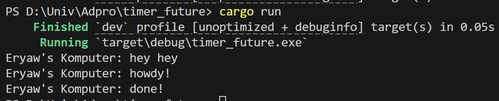
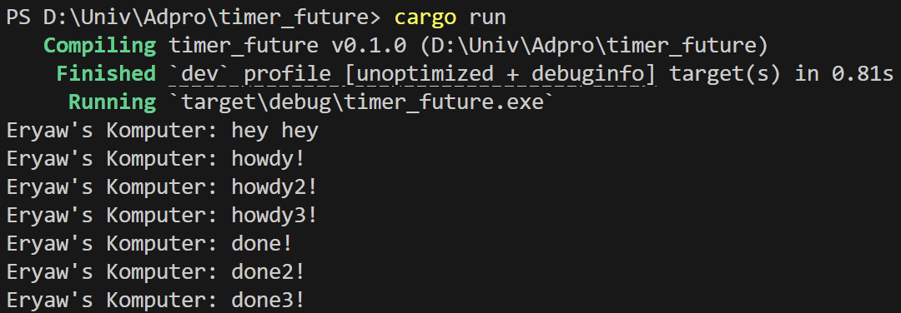
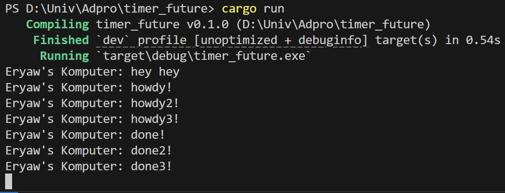

# Experiment 1.2: Understanding how it works.

Pada asynchronous, eksekusi kode tidak dilakukan secara sequential seperti menunggu sebuah fungsi selesai sebelum melanjutkan program. Fungsi `main` memulai eksekusi dan membuat executor dan spawner yang dapat dibayangkan sebagai sebuah thread yang berjalan sendiri (spawner tidak akan langsung dieksekusi). Kemudian thread tersebut mencetak "howdy!", menunggu 2 detik, dan mencetak "done!". Selanjutnya thread main akan mengeksekusi kode "hey hey". Spawner akan di `drop` untuk memberi tahu tidak ada lagi task yang akan diterima. Kemudian fungsi `main` menjalankan executor yang akan menjalankan spawner task async yang telah dibuat sebelumnya. Sehingga sequence eksekusinya adalah hey hey, dilanjutkan dengan eksekusi spawner yaitu howdy, diakhiri dengan done.

# “Experiment 1.3: Multiple Spawn and removing drop

Sekarang pada `main` terdapat spawner yang akan melakukan spawn 3 kali. Kali ini, program akan melakukan eksekusi (`executor.run()`) yang telah dibuat secara berurutan dengan eksekusi yang dilakukan secara paralel, tidak menunggu task lain. Sehingga howdy!, howdy2!, dan howd3! dijalankan duluan sebelum done!, done2!, dan done3!. 

Saat menggunakan drop, program akan berhenti eksekusinya ketika semua task sudah selesai dijalankan. Tanpa menggunakan drop, program tidak akan pernah berhenti.